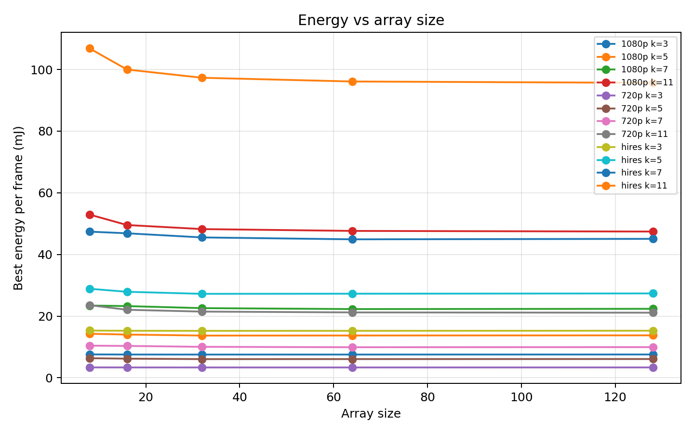
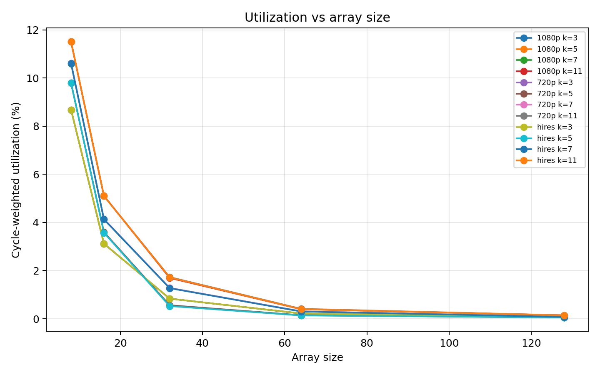
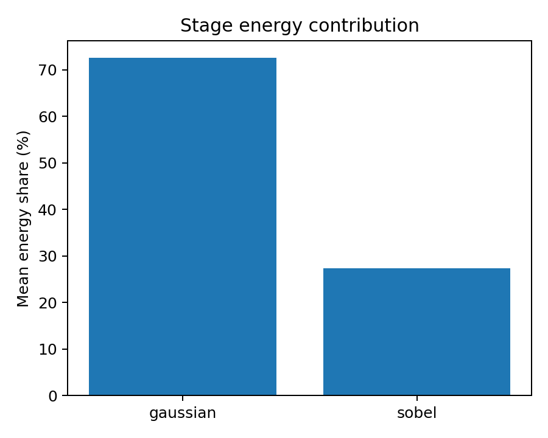
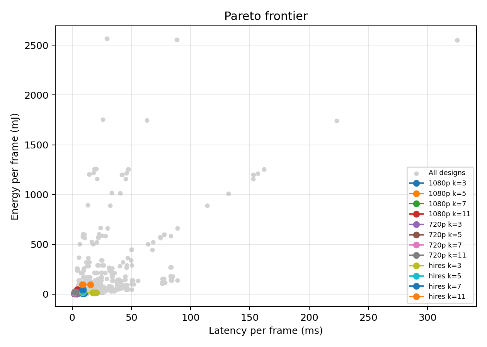

# Deadline-Constrained Systolic Array Design for Image Processing

This project evaluates systolic array accelerator designs for a real-time grayscale image-processing pipeline:

**Gaussian blur -> Sobel edge detection**

The goal is to find the **minimum-energy systolic array configuration** that can process each image frame within a target deadline. The main real-time scenario is **30 FPS**, which gives a deadline of roughly **33 ms per frame**.

The final experiment uses:

- **SCALE-Sim** for systolic-array performance simulation.
- **CACTI 7.0.3DD** to derive SRAM read/write energy for each modeled SRAM capacity.
- **Table-based Accelergy** to combine SCALE-Sim action counts with the CACTI-derived SRAM ERT and reference-level MAC/DRAM assumptions.
- **Tiled full-frame scaling** to keep the simulation tractable.
- **Deadline-constrained analysis** to select energy-efficient feasible designs.

## Problem Statement

Embedded camera and vision systems often need to process frames periodically. For a 30 FPS system, every frame must finish processing in about 33 ms. A design that is extremely fast but wastes energy is not necessarily the best design. The more relevant design objective is:

> Minimize energy per frame while satisfying the frame deadline.

This project models a grayscale front-end vision pipeline and asks:

> Given a fixed frame deadline, which systolic array size, SRAM budget, bandwidth, and dataflow provide the lowest energy while still completing Gaussian blur and Sobel edge detection on time?

The optimization rule is:

1. Compute full-frame latency and energy for each configuration.
2. Remove configurations that miss the deadline.
3. Select the minimum-energy design among the remaining feasible configurations.

## Workload Justification

Gaussian blur and Sobel edge detection are classic DSP and embedded-vision kernels. They are simple enough to model clearly, but they are still meaningful because they touch every pixel in a frame.

A 1080p frame contains:

- 1920 x 1080 pixels.
- 2,073,600 total pixels.

Even a small amount of work per pixel becomes significant when repeated across every frame.

Gaussian blur smooths the image and reduces noise. Sobel edge detection estimates horizontal and vertical gradients to identify edges. The cost of Sobel stays fixed because Sobel uses 3x3 filters, while the Gaussian cost grows with kernel size:

| Gaussian Kernel | Values Per Output Pixel |
| --- | ---: |
| 3x3 | 9 |
| 5x5 | 25 |
| 7x7 | 49 |
| 11x11 | 121 |

This makes the workload useful for accelerator design exploration: as the Gaussian kernel grows, the pipeline bottleneck shifts, and the best systolic array design can change.

## Pipeline Overview

The modeled image-processing pipeline is:

1. Input grayscale image frame.
2. Gaussian blur.
3. Sobel edge detection.
4. Output edge frame.

The end-to-end frame latency is modeled as:

```text
T_frame = T_gaussian + T_sobel
```

The end-to-end frame energy is modeled as:

```text
E_frame = E_gaussian + E_sobel
```

The project focuses on accelerator behavior, not image-quality validation. It does not compare edge maps on real images. The workload is used as a representative embedded image-processing pipeline for performance and energy modeling.

## GEMM Lowering

SCALE-Sim evaluates systolic-array matrix-style workloads, so Gaussian blur and Sobel edge detection are lowered into GEMM-like shapes.

For Gaussian blur:

```text
M = output tile pixels
N = 1
K = kernel_size^2
```

For Sobel edge detection:

```text
M = output tile pixels
N = 2
K = 9
```

Sobel uses `N = 2` because it computes horizontal and vertical gradient outputs. These lowered workloads are relatively skinny GEMMs, which matters because very large systolic arrays may be underutilized when the GEMM shape does not expose enough parallel work.

## Tiled Simulation Methodology

Direct full-frame SCALE-Sim simulation for every hardware configuration would be expensive. Instead, this project uses tiled simulation and analytical full-frame scaling.

The main output tile size is **128 x 128 pixels**. For each image frame, the model derives representative tile classes:

- Full interior tile.
- Right-edge tile.
- Bottom-edge tile.
- Corner tile.

Only unique tile classes are simulated. Their cycle counts and memory-access counts are then multiplied by the number of corresponding tiles in the full frame.

Halo pixels are included because filters need neighboring input pixels around each output tile:

- Gaussian halo radius is `(kernel_size - 1) / 2`.
- Sobel halo radius is `1`.

Halo pixels increase input memory traffic but do not increase the number of output pixels.

## SCALE-Sim + CACTI + Accelergy Methodology

The final modeling pipeline is:

1. Generate Gaussian and Sobel GEMM workloads for each tile class.
2. Run the workloads through SCALE-Sim.
3. Parse cycles, utilization, stalls, and detailed memory accesses.
4. Scale tile-level metrics to full-frame metrics.
5. Run CACTI for each modeled SRAM capacity.
6. Convert CACTI SRAM read/write energy into pJ per byte.
7. Map SCALE-Sim action counts into Accelergy components.
8. Use a table-based Accelergy Energy Reference Table (ERT) to calculate energy.
9. Aggregate frame-level latency, energy, feasibility, and Pareto results.

SCALE-Sim provides:

- Total cycles.
- Stall cycles.
- Overall utilization.
- SRAM IFMAP reads.
- SRAM filter reads.
- SRAM OFMAP writes.
- DRAM IFMAP reads.
- DRAM filter reads.
- DRAM OFMAP writes.

CACTI is used for the on-chip SRAM part of the energy model. The generated SRAM table is:

| SRAM Budget | CACTI Read Energy | CACTI Write Energy | Technology | Access Width |
| ---: | ---: | ---: | ---: | ---: |
| 256 KB | 6.59 pJ/byte | 4.61 pJ/byte | 45 nm | 4 bytes |
| 1024 KB | 10.32 pJ/byte | 8.85 pJ/byte | 45 nm | 4 bytes |
| 4096 KB | 21.09 pJ/byte | 17.17 pJ/byte | 45 nm | 4 bytes |

This matters because larger SRAMs now have higher access energy. The previous fixed-SRAM model treated all SRAM budgets as if they had the same pJ/byte cost.

Accelergy is used in **table-based mode**. SCALE-Sim action counts are mapped to these Accelergy components:

| SCALE-Sim Count | Accelergy Component | Action |
| --- | --- | --- |
| MAC operations | `accelerator.mac_array` | `mac` |
| SRAM IFMAP reads | `accelerator.ifmap_sram` | `read` |
| SRAM filter reads | `accelerator.filter_sram` | `read` |
| SRAM OFMAP writes | `accelerator.ofmap_sram` | `write` |
| DRAM IFMAP reads | `accelerator.ifmap_dram` | `read` |
| DRAM filter reads | `accelerator.filter_dram` | `read` |
| DRAM OFMAP writes | `accelerator.ofmap_dram` | `write` |

The MAC energy is modeled as a reference-level 8-bit MAC assumption of **0.23 pJ per MAC**. DRAM energy is modeled as a reference-level off-chip cost of **160 pJ per byte**. CACTI is used only for on-chip SRAM, so the energy numbers should still be treated as **relative design comparisons**, not silicon-accurate measurements.

## Design Space

The sweep covers both workload parameters and hardware parameters.

### Workload Parameters

| Parameter | Values |
| --- | --- |
| Resolutions | 720p, 1080p, 2048 x 2048 |
| Gaussian kernels | 3x3, 5x5, 7x7, 11x11 |
| Deadlines | 33 ms, 100 ms, 200 ms |
| Primary tile size | 128 x 128 |
| Sanity tile size | 64 x 64 |

### Hardware Parameters

| Parameter | Values |
| --- | --- |
| Array sizes | 8x8, 16x16, 32x32, 64x64, 128x128 |
| SRAM budgets | 256 KB, 1024 KB, 4096 KB |
| Bandwidths | 50 GB/s, 200 GB/s, 800 GB/s |
| Dataflows | weight-stationary, output-stationary |
| Frequency | 1 GHz |
| Word size | 1 byte |

## Repository Layout

```text
configs/experiment.yaml       Main experiment specification.
configs/cacti_sram_45nm.csv   CACTI-derived SRAM energy table.
scripts/run_sweep.py          Runs SCALE-Sim sweeps with caching and resume support.
scripts/run_cacti_sram_model.py Generates the SRAM energy table from a CACTI binary.
scripts/summarize_results.py  Aggregates raw runs and generates CSVs/plots.
scripts/smoke_test_scalesim.py Validates SCALE-Sim compatibility.
scripts/smoke_test_accelergy.py Validates Accelergy energy accounting.
src/hpc_final/                Reusable Python package for modeling and analysis.
outputs/summary_cacti_accelergy/ Final CACTI + Accelergy summary CSVs.
figures_cacti_accelergy/      Final plots generated from CACTI-backed summaries.
misc/                         Archived non-core artifacts and legacy outputs.
```

## Setup

Create or use a Python virtual environment, then install the required packages:

```bash
.venv/bin/pip install -r requirements.txt
```

`numpy==1.26.4` is pinned because SCALE-Sim 3.0.0 has NumPy 2.x compatibility issues in this environment.

Accelergy is optional for the analytical path, but required for the Accelergy-backed summaries. Install the tested GitHub version with:

```bash
GIT_CONFIG_COUNT=1 \
GIT_CONFIG_KEY_0=url.https://github.com/.insteadOf \
GIT_CONFIG_VALUE_0=git@github.com: \
.venv/bin/python -m pip install \
'git+https://github.com/Accelergy-Project/accelergy.git@6911d15686ee7efdceba7d95605102df4472ae3a'
```

CACTI is required only when regenerating `configs/cacti_sram_45nm.csv`. The checked-in table is already generated, but the model can be reproduced with a local CACTI build. The tested source is the Hewlett Packard CACTI repository:

```bash
git clone https://github.com/HewlettPackard/cacti.git /tmp/hpc-final-cacti
cd /tmp/hpc-final-cacti
perl -0pi -e 's/DeviceType \*dt = &\(g_tp\.peri_global\)/DeviceType *dt/' nuca.cc
make -f cacti.mk TAG=opt OPT='-O2 -DNTHREADS=1' CXX='g++' CC='gcc' -j4
```

On Apple Silicon, the default CACTI makefile may fail because it includes old debug and x86 SSE flags. The command above bypasses those flags. The `perl` command removes a default argument from a CACTI constructor definition that newer Clang rejects.

## Running The Experiment

Validate SCALE-Sim:

```bash
.venv/bin/python scripts/smoke_test_scalesim.py
```

Validate Accelergy:

```bash
.venv/bin/python scripts/smoke_test_accelergy.py
```

Regenerate the CACTI SRAM table if needed:

```bash
.venv/bin/python scripts/run_cacti_sram_model.py \
  --cacti-bin /tmp/hpc-final-cacti/cacti \
  --template /tmp/hpc-final-cacti/cache.cfg \
  --out configs/cacti_sram_45nm.csv \
  --work-dir misc/cacti \
  --technology-um 0.045 \
  --access-bytes 4
```

Run the sanity sweep:

```bash
.venv/bin/python scripts/run_sweep.py --mode sanity
.venv/bin/python scripts/summarize_results.py
```

Run the full SCALE-Sim sweep:

```bash
.venv/bin/python scripts/run_sweep.py --mode full --workers 4
```

Generate final CACTI + Accelergy-backed summaries and figures:

```bash
.venv/bin/python scripts/summarize_results.py \
  --tile-width 128 \
  --tile-height 128 \
  --energy-backend accelergy \
  --out outputs/summary_cacti_accelergy \
  --figures figures_cacti_accelergy
```

Run tests:

```bash
.venv/bin/pytest -q
```

## Generated Outputs

The final CACTI + Accelergy-backed outputs are in `outputs/summary_cacti_accelergy/`.

| File | Description |
| --- | --- |
| `all_runs.csv` | Stage-level Gaussian and Sobel rows. |
| `pipeline_runs.csv` | End-to-end frame-level latency and energy. |
| `feasible_designs.csv` | Deadline-expanded feasibility table. |
| `minimum_energy_designs.csv` | Minimum-energy feasible design per scenario. |
| `pareto_frontier.csv` | Non-dominated feasible designs. |
| `bottleneck_summary.csv` | Gaussian vs. Sobel latency and energy shares. |
| `accelergy_action_counts.csv` | Component action counts passed into Accelergy. |
| `accelergy_ERT.yaml` | Table-based Accelergy Energy Reference Table with CACTI-derived SRAM entries by budget. |
| `skipped_runs.csv` | Simulator cases excluded by resource guard. |

The final dataset contains:

| Output | Rows |
| --- | ---: |
| Stage-level rows | 3,570 |
| Complete pipeline configurations | 1,071 |
| Feasibility rows | 3,213 |
| Pareto-frontier rows | 153 |
| Minimum-energy design rows | 36 |
| Bottleneck-summary rows | 2,142 |
| Accelergy action-count rows | 24,990 |

## Results

### Minimum-Energy Feasible Designs

For the main **1080p @ 33 ms** scenario, the minimum-energy feasible designs are:

| Gaussian Kernel | Best Design | SRAM | Bandwidth | Latency | Energy |
| --- | --- | ---: | ---: | ---: | ---: |
| 3x3 | 32x32 output-stationary | 1024 KB | 50 GB/s | 10.07 ms | 7.53 mJ |
| 5x5 | 32x32 weight-stationary | 256 KB | 50 GB/s | 4.61 ms | 13.69 mJ |
| 7x7 | 64x64 weight-stationary | 256 KB | 50 GB/s | 4.64 ms | 22.29 mJ |
| 11x11 | 128x128 weight-stationary | 256 KB | 50 GB/s | 7.62 ms | 47.43 mJ |

The main result is that the CACTI-backed SRAM model changes the design choices for medium and large kernels. Larger SRAMs now cost more energy per byte, so the minimum-energy feasible designs prefer **256 KB SRAM** for the 5x5, 7x7, and 11x11 cases. The 3x3 case still prefers a **32x32 output-stationary** array, while heavier kernels shift toward **weight-stationary** designs and larger arrays.

### Latency Scaling


The latency plot shows that larger arrays reduce latency for heavier kernels, but latency improvements are not uniform across all kernel sizes. Small kernels can stop benefiting from larger arrays because their GEMM shapes do not expose enough work to keep very large arrays fully occupied.

### Energy Scaling



Energy does not always decrease when array size increases. The CACTI-backed results also show that larger SRAM budgets are not automatically better: larger SRAMs can reduce some traffic behavior, but their higher access energy can make them lose on total energy.

### Utilization And Stalls




The utilization and stall plots help explain why larger arrays are not always the best energy choice. A large array has more compute capacity, but if the workload is skinny or too small, many processing elements may not contribute useful work.

### Stage Energy Share



Gaussian blur becomes more dominant as kernel size grows:

| Gaussian Kernel | Gaussian Energy Share | Sobel Energy Share |
| --- | ---: | ---: |
| 3x3 | 47.61% | 52.39% |
| 5x5 | 67.16% | 32.84% |
| 7x7 | 79.80% | 20.20% |
| 11x11 | 90.48% | 9.52% |

This confirms that for large kernels, the Gaussian stage dominates the pipeline. Optimizing Sobel has limited impact in the 11x11 case because Sobel is only a small fraction of total energy.

### Pareto Frontier



The Pareto frontier shows the latency-energy tradeoff among feasible configurations. A Pareto design is not dominated by another design in both latency and energy. This is useful because the fastest design is not always the minimum-energy design.

## Discussion

The key architectural lesson is that **bigger hardware is not automatically better**.

A 128x128 systolic array has far more compute capacity than a 32x32 array, but that capacity is only useful if the workload can keep the array busy. For small kernels, the lowered GEMMs are skinny enough that the largest array can be underutilized. In those cases, a moderate 32x32 array can meet the frame deadline with lower energy.

The CACTI-backed SRAM model adds another tradeoff. A larger SRAM budget can be useful for performance, but CACTI estimates higher access energy for larger SRAMs. In the final results, this pushes the 5x5, 7x7, and 11x11 minimum-energy designs toward 256 KB SRAM instead of 4096 KB SRAM. This is the main reason the CACTI-backed experiment is more defensible than the previous fixed-SRAM ERT.

For the 11x11 Gaussian kernel, the situation changes again. The Gaussian blur stage now performs 121 weighted input operations per output pixel, compared with only 9 for the 3x3 case. The larger workload creates enough computation for a 128x128 array to become useful. The best dataflow also shifts to weight-stationary, which is consistent with the increased reuse of filter weights in the larger Gaussian stage.

The deadline-constrained framing matters. If the only goal were minimum latency, the experiment would favor larger and higher-bandwidth designs more often. But for an embedded real-time service, the system only needs to be fast enough. Once a design satisfies the 33 ms deadline, excess speed is less valuable than lower energy.

## Limitations

This experiment is intentionally scoped for a reproducible class project.

The main limitations are:

- The workload models grayscale 8-bit images only.
- The experiment evaluates accelerator performance, not image quality.
- Full-frame behavior is estimated from tiled simulations and analytical scaling.
- CACTI is used for SRAM dynamic access energy, but not for full accelerator timing, wire energy, leakage over frame time, or off-chip DRAM system energy.
- MAC and DRAM energy still use reference-level assumptions.
- Accelergy is used in table-based mode, not with Timeloop architecture mapping or Aladdin component modeling.
- Energy values are best interpreted as relative design comparisons.
- A small number of pathological SCALE-Sim cases were skipped by a resource guard and recorded in `skipped_runs.csv`.

The skipped cases are output-stationary 11x11 Gaussian full-tile simulations on 128x128 arrays. They triggered excessive SCALE-Sim demand generation and were excluded from full pipeline summaries so partial tile results would not contaminate frame-level metrics.

## Takeaways

The final conclusions are:

- The best systolic array is workload-dependent and deadline-dependent.
- CACTI-derived SRAM energy makes SRAM capacity part of the energy tradeoff instead of a fixed-cost parameter.
- For the 3x3 Gaussian kernel, a 32x32 output-stationary array is the minimum-energy feasible design in the main 1080p @ 33 ms scenario.
- For 5x5 and larger Gaussian kernels, the minimum-energy feasible designs shift toward weight-stationary dataflow and smaller SRAM budgets.
- For the 11x11 Gaussian kernel, the workload becomes large enough that a 128x128 weight-stationary array becomes the best feasible design.
- Gaussian blur becomes the dominant energy contributor as kernel size increases.
- Minimum latency and minimum energy are different objectives.
- In a deadline-constrained embedded system, the best design is not necessarily the fastest design; it is the lowest-energy design that is fast enough.

In short:

> Size the accelerator to the workload and deadline. Do not simply choose the largest array.
