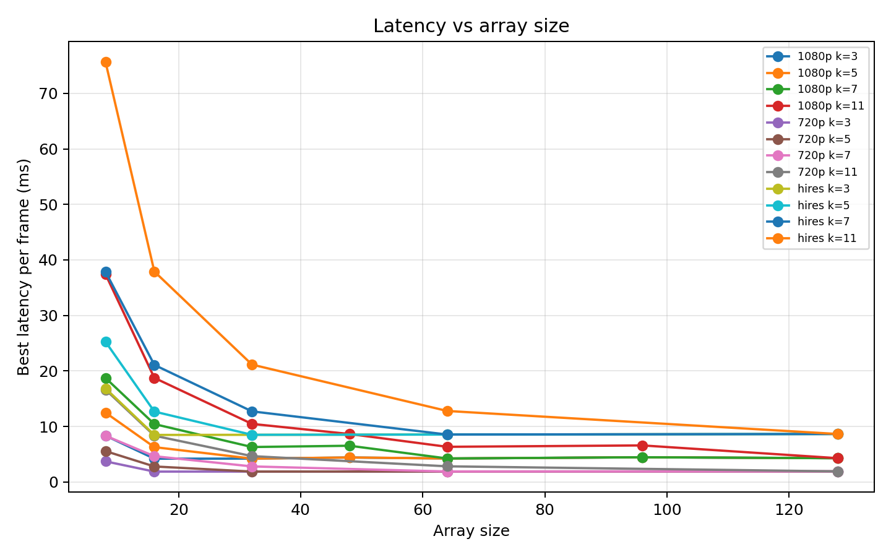
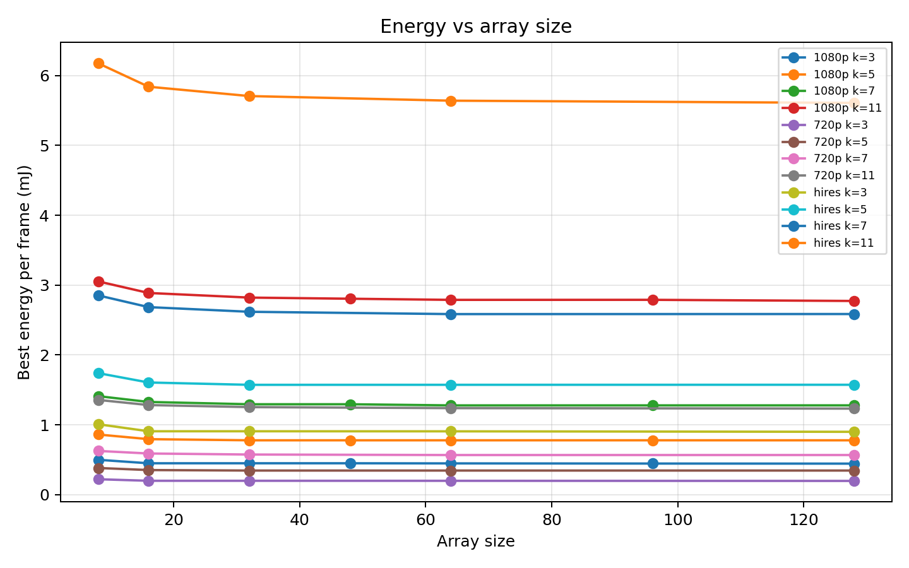
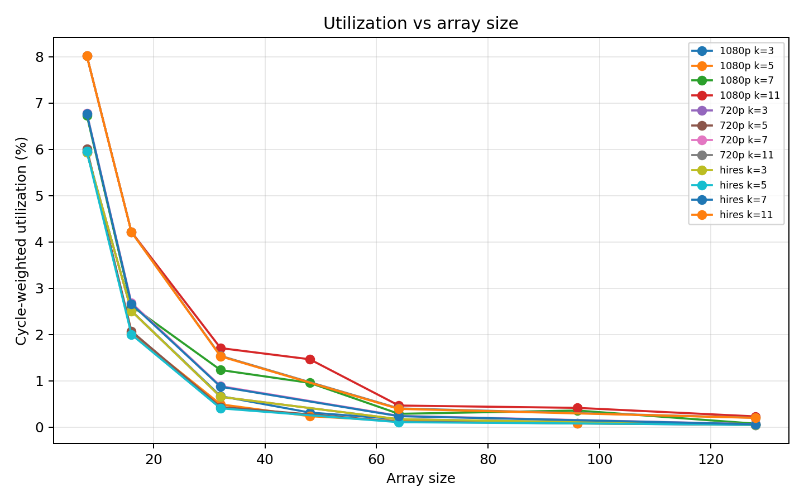
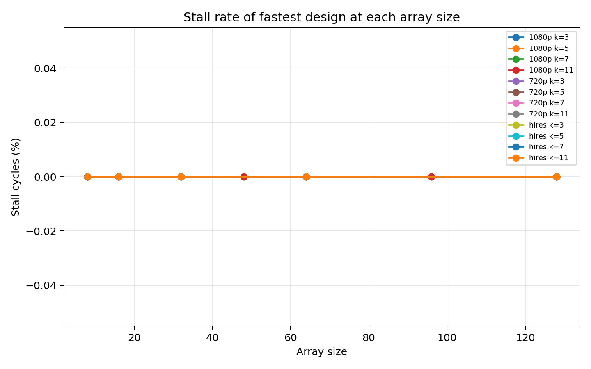
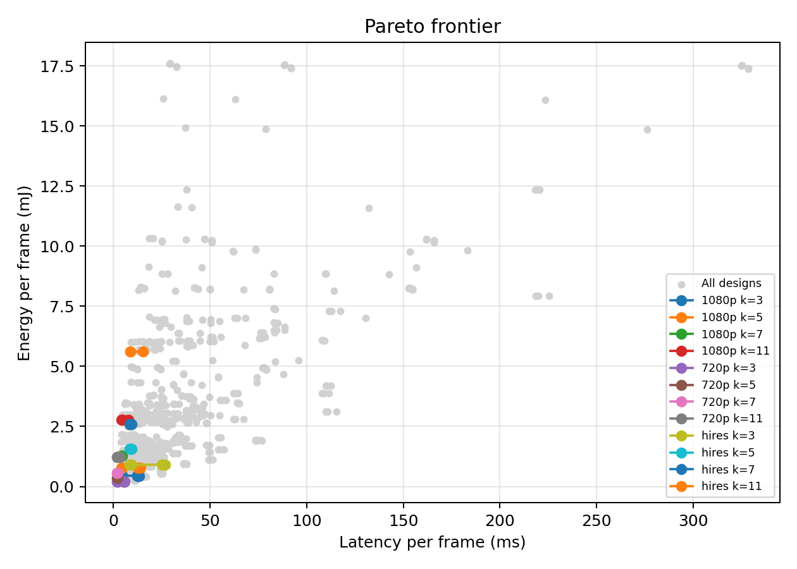

# Deadline-Constrained Systolic Array Design for Image Processing

This project evaluates systolic array accelerator designs for a real-time grayscale image-processing pipeline:

**Gaussian blur -> Sobel edge detection**

The goal is to find the **minimum-energy systolic array configuration** that can process each image frame within a target deadline. The main real-time scenario is **30 FPS**, which gives a deadline of roughly **33 ms per frame**.

The final experiment uses:

- **SCALE-Sim** for systolic-array performance simulation.
- **Accelergy** for action-count energy calculation through the component-library/table-plug-in path.
- **Tiled full-frame scaling** to keep the experiment tractable.
- **A focused refinement sweep** around the main 1080p real-time objective.
- **Deadline-constrained design selection** to choose energy-efficient feasible hardware.

This version follows the same general direction as the class SCALE-Sim + Accelergy assignments: simulate accelerator performance, convert the simulator results into action counts, let Accelergy provide an Energy Reference Table, and report latency, energy, and EDP. CACTI is not part of the active pipeline.

## Submission Package Checklist

The final submission should include code, data, and report artifacts:

| Requirement | Project Artifact |
| --- | --- |
| README with setup and reproduction instructions | `README.md` |
| Source and scripts used for results | `src/hpc_final/`, `scripts/`, `configs/experiment.yaml` |
| Raw and summarized data used in the report | `outputs/raw/`, `outputs/summary_accelergy_plugin/` |
| Figures used in the report | `figures_accelergy_plugin/` |
| Final report source | `FINAL_REPORT.tex` |
| Report draft/supporting formatted copy | `FINAL_REPORT.md`, `FINAL_REPORT.docx` |
| Tests for framework behavior | `tests/` |

The final report follows the required sections: Introduction, System Design and Implementation Details, Experimental Results and Evaluation, Conclusions, Team Contributions and Acknowledgement, and References.

## Problem Statement

Embedded camera and vision systems often process frames on a fixed schedule. A 30 FPS system receives a new frame every 33 ms, so the accelerator must finish the full image-processing pipeline before the next frame arrives.

A design that finishes in 2 ms may waste energy if a smaller design can finish in 20 ms. For a deadline-constrained embedded system, the useful objective is:

> Minimize energy per frame while satisfying the frame deadline.

This project asks:

> Given a frame resolution and deadline, which systolic array size, SRAM budget, memory bandwidth, and dataflow gives the lowest energy while still completing Gaussian blur and Sobel edge detection on time?

The selection rule is:

1. Simulate each hardware design on the image-processing workload.
2. Scale tile-level results to the full frame.
3. Compute latency, energy, average power, and EDP.
4. Remove designs that miss the deadline.
5. Pick the minimum-energy design among the feasible designs.

## Workload Justification

Gaussian blur and Sobel edge detection are good workloads for this project because they are classic DSP and embedded-vision kernels. They are simple enough to model clearly, but large enough to expose real architecture tradeoffs because they touch every pixel in every frame.

A 1080p frame contains:

- 1920 x 1080 pixels.
- 2,073,600 total pixels.

Even a small amount of computation per pixel becomes meaningful when repeated across the full frame and across every frame period.

Gaussian blur smooths the image and reduces noise before edge detection. Sobel edge detection then estimates horizontal and vertical gradients to highlight edges. This is a common front-end image-processing pattern: first reduce noise, then detect structure.

The Gaussian workload scales with kernel size:

| Gaussian Kernel | Values Per Output Pixel |
| --- | ---: |
| 3x3 | 9 |
| 5x5 | 25 |
| 7x7 | 49 |
| 11x11 | 121 |

Sobel uses the standard 3x3 Sobel filters, so its per-pixel filter size stays fixed. This creates a useful experiment: as the Gaussian kernel grows, the Gaussian stage becomes heavier and the best accelerator design can change.

## Pipeline Overview

The modeled pipeline is:

1. Read an 8-bit grayscale image frame.
2. Run Gaussian blur.
3. Run Sobel edge detection.
4. Produce an output edge frame.

The frame latency is modeled as:

```text
T_frame = T_gaussian + T_sobel
```

The frame energy is modeled as:

```text
E_frame = E_gaussian + E_sobel
```

The output overhead is set to 0 cycles in `configs/experiment.yaml`. This is an explicit modeling assumption so the experiment focuses on the two compute stages.

The project models accelerator behavior, not image quality. It does not compare real edge maps or tune filter coefficients visually. The workload is used as a representative embedded image-processing service.

## GEMM Lowering

SCALE-Sim models matrix-style workloads on systolic arrays. Gaussian blur and Sobel edge detection are therefore lowered into GEMM-like shapes.

For Gaussian blur:

```text
M = output tile pixels
N = 1
K = kernel_size^2
```

For Sobel edge detection:

```text
M = output tile pixels
N = 2
K = 9
```

`M` is the number of output pixels produced by the tile. `N` is the number of output channels or filters. `K` is the number of input values used to produce each output value.

Gaussian uses `N = 1` because one blurred grayscale output is produced per pixel. Sobel uses `N = 2` because Sobel computes two gradients: one horizontal gradient and one vertical gradient. Sobel uses `K = 9` because the standard Sobel operator is 3x3.

These shapes are relatively skinny GEMMs. That matters because very large systolic arrays may not stay fully utilized when the matrix shape does not expose enough parallel work.

## Tiled Simulation

Directly simulating a full image frame for every configuration would be too slow. The experiment simulates representative tiles, then scales the results to the full frame.

The main output tile size is **128 x 128 pixels**. For each frame, the model derives tile classes:

- Full interior tile.
- Right-edge tile.
- Bottom-edge tile.
- Corner tile.

Only unique tile classes are simulated. Their cycles and memory accesses are multiplied by the number of times each tile class appears in the full frame.

Halo pixels are included because convolution-style filters need neighboring input pixels:

- Gaussian halo radius is `(kernel_size - 1) / 2`.
- Sobel halo radius is `1`.

Halo pixels increase input memory traffic. They do not increase the number of output pixels.

## SCALE-Sim + Accelergy Methodology

The final modeling pipeline is:

1. Generate Gaussian and Sobel GEMM workloads for each tile class.
2. Run each workload through SCALE-Sim.
3. Parse cycles, stalls, utilization, and detailed memory accesses.
4. Scale tile-level metrics to full-frame metrics.
5. Convert SCALE-Sim memory and compute counts into Accelergy action counts.
6. Generate a table-based Accelergy Energy Reference Table through the component-library/table-plug-in path.
7. Use Accelergy-derived per-action costs to calculate per-component and total energy.
8. Aggregate latency, energy, power, EDP, feasibility, bottlenecks, and Pareto fronts.

SCALE-Sim provides the performance side:

- Total cycles.
- Stall cycles.
- Utilization.
- SRAM IFMAP reads.
- SRAM filter reads.
- SRAM OFMAP writes.
- DRAM IFMAP reads.
- DRAM filter reads.
- DRAM OFMAP writes.

Accelergy provides the energy-accounting side. The project uses the `accelergy_plugin` backend, which writes architecture/action-count probe YAML, runs the Accelergy CLI with SCALE-Sim-Accelergy component YAMLs and table plug-ins, parses the generated `energy_estimation.yaml`, and applies those generated pJ/action values to the SCALE-Sim counts.

The project maps SCALE-Sim counts into the SCALE-Sim-Accelergy branch's component names:

| SCALE-Sim Count | Accelergy Component | Action |
| --- | --- | --- |
| MAC operations | `systolic_array.PE[0..N].mac` | `mac_random` |
| SRAM IFMAP reads | `systolic_array.ifmap_glb` | `read` |
| SRAM filter reads | `systolic_array.weights_glb` | `read` |
| SRAM OFMAP writes | `systolic_array.psum_glb` | `update` |
| DRAM IFMAP reads | `systolic_array.ifmap_dram` | `read` |
| DRAM filter reads | `systolic_array.weights_dram` | `read` |
| DRAM OFMAP writes | `systolic_array.psum_dram` | `write` |

The `accelergy_plugin` backend auto-detects the sibling assignment installs used in this workspace. If that fails on another machine, configure:

```yaml
energy:
  accelergy_plugin:
    accelergy_bin: ../hpc-assignment-2/.venv/bin/accelergy
    component_dir: ../hpc-assignment-1/deps/SCALE-Sim-Accelergy/rundir-accelergy/accelergy_input/components
```

The generated Accelergy files are saved in the selected summary directory:

- `accelergy_action_counts.csv`
- `accelergy_backend.yaml`
- `accelergy_plugin/*/inputs/architecture.yaml`
- `accelergy_plugin/*/inputs/action_count.yaml`
- `accelergy_plugin/*/outputs/ERT.yaml`
- `accelergy_plugin/*/outputs/energy_estimation.yaml`

## Design Space

The sweep covers both workload parameters and hardware parameters.

| Workload Parameter | Values |
| --- | --- |
| Resolutions | 720p, 1080p, 2048 x 2048 |
| Gaussian kernels | 3x3, 5x5, 7x7, 11x11 |
| Deadlines | 33 ms, 100 ms, 200 ms |
| Primary tile size | 128 x 128 |
| Sanity tile size | 64 x 64 |

| Hardware Parameter | Values |
| --- | --- |
| Coarse array sizes | 8x8, 16x16, 32x32, 64x64, 128x128 |
| 1080p refinement array sizes | 32x32, 48x48, 64x64, 96x96, 128x128 |
| Coarse SRAM budgets | 256 KB, 1024 KB, 4096 KB |
| 1080p refinement SRAM budgets | 256 KB, 512 KB, 1024 KB, 2048 KB, 4096 KB |
| Coarse bandwidths | 50 GB/s, 200 GB/s, 800 GB/s |
| 1080p refinement bandwidths | 50 GB/s, 100 GB/s |
| Coarse dataflows | weight-stationary, output-stationary, input-stationary |
| 1080p refinement dataflows | weight-stationary, input-stationary |
| Frequency | 1 GHz |
| Word size | 1 byte |

The initial full sweep remains broad and powers-of-two oriented. The focused refinement pass answers the coarse-step limitation by sampling intermediate array sizes, SRAM budgets, and bandwidth near the main 1080p @ 33 ms feasible/low-energy region. Output-stationary remains in the coarse sweep, but the refinement pass focuses on weight-stationary and input-stationary because output-stationary did not win any coarse Pareto or minimum-energy row and has known large-kernel SCALE-Sim resource pathologies.

The summary also reports `cycles_x_pes`, which matches the class assignment style of comparing cycle count against the amount of hardware used.

## Repository Layout

```text
configs/experiment.yaml        Main experiment specification and Accelergy plug-in options.
scripts/run_sweep.py           Runs SCALE-Sim sweeps with caching and resume support.
scripts/summarize_results.py   Aggregates raw runs and generates CSVs/plots.
scripts/smoke_test_scalesim.py Validates SCALE-Sim compatibility.
scripts/smoke_test_accelergy.py Validates Accelergy ERT/action-count accounting.
src/hpc_final/                 Reusable Python package for modeling and analysis.
outputs/summary_accelergy_plugin/ Final Accelergy plug-in-backed summary CSVs and ERT files.
figures_accelergy_plugin/      Final plots generated from Accelergy plug-in-backed summaries.
misc/                          Archived non-core artifacts and older explanation files.
```

## Setup

Create or use a Python virtual environment, then install the required packages:

```bash
.venv/bin/pip install -r requirements.txt
```

`numpy==1.26.4` is pinned because SCALE-Sim 3.0.0 has NumPy 2.x compatibility issues in this environment.

Accelergy is installed from a pinned GitHub commit in `requirements.txt`. CACTI is not required for the final pipeline.

## Running The Experiment

Validate SCALE-Sim:

```bash
.venv/bin/python scripts/smoke_test_scalesim.py
```

Validate Accelergy:

```bash
.venv/bin/python scripts/smoke_test_accelergy.py
```

Run the sanity sweep:

```bash
.venv/bin/python scripts/run_sweep.py --mode sanity
.venv/bin/python scripts/summarize_results.py --energy-backend accelergy_plugin
```

Run the full SCALE-Sim sweep:

```bash
.venv/bin/python scripts/run_sweep.py --mode full --workers 4
```

Run the focused 1080p refinement sweep:

```bash
.venv/bin/python scripts/run_sweep.py --mode refinement --workers 4
```

Generate final Accelergy-backed summaries and figures:

```bash
.venv/bin/python scripts/summarize_results.py \
  --config configs/experiment.yaml \
  --results outputs/raw \
  --energy-backend accelergy_plugin \
  --tile-width 128 \
  --tile-height 128 \
  --out outputs/summary_accelergy_plugin \
  --figures figures_accelergy_plugin
```

Run tests:

```bash
.venv/bin/pytest -q
```

Build the LaTeX report PDF on a machine with a TeX distribution installed:

```bash
latexmk -pdf FINAL_REPORT.tex
```

If `latexmk` is unavailable, run `pdflatex FINAL_REPORT.tex` twice so references and figure numbers resolve.

Build the optional DOCX copy with a Python environment that has `python-docx` installed:

```bash
python report/build_final_report_docx.py
```

That report builder only assembles existing result tables and figures. Experiment execution and chart generation stay in `scripts/run_sweep.py` and `scripts/summarize_results.py`.

## Generated Outputs

The final outputs are in `outputs/summary_accelergy_plugin/`.

| File | Description |
| --- | --- |
| `all_runs.csv` | Stage-level Gaussian and Sobel rows. |
| `pipeline_runs.csv` | End-to-end frame-level latency and energy. |
| `feasible_designs.csv` | Deadline-expanded feasibility table. |
| `minimum_energy_designs.csv` | Minimum-energy feasible design per scenario. |
| `pareto_frontier.csv` | Non-dominated feasible designs. |
| `bottleneck_summary.csv` | Gaussian vs. Sobel latency and energy shares. |
| `accelergy_action_counts.csv` | Component action counts passed into Accelergy. |
| `accelergy_plugin/*/outputs/ERT.yaml` | Generated Accelergy Energy Reference Tables. |
| `accelergy_backend.yaml` | Metadata describing the Accelergy binary, component library, generated ERTs, and pJ/action values. |
| `skipped_runs.csv` | Simulator cases excluded by the resource guard. |
| `rerun_skipped_log.csv` | Log from the main skipped-only retry batch, including completed and RSS-limited cases. |

The main plot outputs are in `figures_accelergy_plugin/`, including the appendix charts `energy_latency_scatter.png`, `stage_share_by_kernel.png`, and `component_energy_split.png`.

The final dataset contains:

| Output | Rows |
| --- | ---: |
| Stage-level rows | 6,052 |
| Complete pipeline configurations | 1,767 |
| Feasibility rows | 5,301 |
| Pareto-frontier rows | 165 |
| Minimum-energy design rows | 36 |
| Bottleneck-summary rows | 3,534 |
| Accelergy action-count rows | 42,364 |
| Skipped simulator rows | 280 |

## Results

For the main **1080p @ 33 ms** scenario, the minimum-energy feasible designs are:

| Gaussian Kernel | Best Design | SRAM | Bandwidth | Latency | Energy | EDP |
| --- | --- | ---: | ---: | ---: | ---: | ---: |
| 3x3 | 128x128 input-stationary | 1024 KB | 50 GB/s | 13.30 ms | 0.45 mJ | 5.92 mJ-ms |
| 5x5 | 128x128 input-stationary | 2048 KB | 50 GB/s | 13.96 ms | 0.78 mJ | 10.88 mJ-ms |
| 7x7 | 64x64 weight-stationary | 256 KB | 50 GB/s | 4.64 ms | 1.28 mJ | 5.93 mJ-ms |
| 11x11 | 128x128 weight-stationary | 256 KB | 50 GB/s | 7.62 ms | 2.77 mJ | 21.12 mJ-ms |

Under the generated Accelergy table-plug-in ERTs, input-stationary wins the smaller 3x3 and 5x5 1080p cases, while weight-stationary still wins the 7x7 and 11x11 cases. The focused refinement pass did not find a lower-energy 1080p design than the coarse pass, but it did improve the selected 5x5 SRAM point from 4096 KB to 2048 KB at the same modeled energy and latency. The selected array size, SRAM budget, and dataflow are therefore workload-dependent, not fixed preferences for one hardware setting.

The 33 ms winners by resolution are:

| Resolution | Kernel | Best Design | Latency | Energy |
| --- | ---: | --- | ---: | ---: |
| 720p | 3x3 | 128x128 IS, 1024 KB, 50 GB/s | 5.91 ms | 0.20 mJ |
| 720p | 5x5 | 32x32 WS, 256 KB, 50 GB/s | 2.05 ms | 0.35 mJ |
| 720p | 7x7 | 64x64 WS, 256 KB, 50 GB/s | 2.06 ms | 0.57 mJ |
| 720p | 11x11 | 128x128 WS, 256 KB, 50 GB/s | 3.39 ms | 1.23 mJ |
| 1080p | 3x3 | 128x128 IS, 1024 KB, 50 GB/s | 13.30 ms | 0.45 mJ |
| 1080p | 5x5 | 128x128 IS, 2048 KB, 50 GB/s | 13.96 ms | 0.78 mJ |
| 1080p | 7x7 | 64x64 WS, 256 KB, 50 GB/s | 4.64 ms | 1.28 mJ |
| 1080p | 11x11 | 128x128 WS, 256 KB, 50 GB/s | 7.62 ms | 2.77 mJ |
| 2048x2048 | 3x3 | 128x128 IS, 1024 KB, 50 GB/s | 26.89 ms | 0.90 mJ |
| 2048x2048 | 5x5 | 32x32 WS, 256 KB, 50 GB/s | 9.29 ms | 1.57 mJ |
| 2048x2048 | 7x7 | 64x64 WS, 256 KB, 50 GB/s | 9.34 ms | 2.59 mJ |
| 2048x2048 | 11x11 | 128x128 WS, 256 KB, 50 GB/s | 15.37 ms | 5.61 mJ |

### Latency Scaling



Latency improves as array size increases, especially for heavier kernels. The improvement is not uniform. Smaller kernels can stop benefiting from larger arrays because their lowered GEMM shapes do not keep every processing element busy.

### Energy Scaling



Energy is affected by both work and hardware utilization. A larger array can reduce latency, but extra compute capacity does not automatically reduce energy. In this Accelergy plug-in run, the generated SRAM action energies are the same across the tested SRAM capacities, so SRAM capacity affects energy through the SCALE-Sim access counts rather than through different SRAM circuit costs.

### Utilization And Stalls





The utilization and stall plots explain why the largest array is not always the best design. A 128x128 array has more processing elements, but skinny GEMM shapes can leave many of them underused. This is why moderate arrays can be more energy-efficient for smaller kernels.

### Stage Energy Share


For the 1080p @ 33 ms minimum-energy designs, the stage energy shares are:

| Gaussian Kernel | Gaussian Energy Share | Sobel Energy Share |
| --- | ---: | ---: |
| 3x3 | 45.91% | 54.09% |
| 5x5 | 69.09% | 30.91% |
| 7x7 | 81.01% | 18.99% |
| 11x11 | 91.24% | 8.76% |

The Gaussian stage becomes dominant as kernel size grows. For the 11x11 case, most of the energy is spent in Gaussian blur, so optimizing Sobel would have limited impact on total frame energy.

### Pareto Frontier



The Pareto frontier shows the latency-energy tradeoff among feasible configurations. A Pareto design is one where no other feasible design is both faster and lower energy. This matters because minimum latency and minimum energy are different objectives.

## Discussion

The main architectural result is that the best systolic array depends on the workload and deadline.

For the 3x3 and 5x5 Gaussian kernels, the minimum-energy 1080p @ 33 ms design shifts to input-stationary after adding the IS SCALE-Sim runs. Those designs are slower than the previous weight-stationary picks but still meet the 33 ms deadline and have slightly lower Accelergy-derived energy.

The focused refinement pass then checks whether the coarse powers-of-two grid hid a better 1080p objective value. It adds 48x48 and 96x96 arrays, 512 KB and 2048 KB SRAM points, and a 100 GB/s bandwidth point. The 3x3, 7x7, and 11x11 winners remain unchanged. The 5x5 winner keeps the same 128x128 input-stationary latency and energy, but the selected SRAM budget drops from 4096 KB to 2048 KB because the finer SRAM grid exposes an equivalent-energy point with less local storage.

For the 7x7 Gaussian kernel, the minimum-energy design remains a 64x64 weight-stationary array. Moving to a larger array can reduce latency, but the extra hardware does not always reduce energy.

For the 11x11 Gaussian kernel, the computation per output pixel rises to 121 Gaussian filter values before Sobel even runs. That larger workload gives the 128x128 weight-stationary array enough work to become the minimum-energy feasible design.

The deadline framing changes the design decision. A real-time embedded service only needs to finish before the next frame period. Once a design satisfies the deadline, lower energy becomes more valuable than extra speed.

The `accelergy_plugin` path keeps the energy calculation closer to the assignment: SCALE-Sim produces per-stage action counts, the repo writes Accelergy architecture/action-count inputs, Accelergy generates the ERT through its component library/table plug-ins, and the generated pJ/action values are applied to the design sweep. The results are still comparative modeling results, not measured hardware energy.

## Limitations

This experiment is scoped for a reproducible class project.

The main limitations are:

- The workload models grayscale 8-bit images only.
- The experiment evaluates accelerator performance and energy modeling, not image quality.
- Full-frame behavior is estimated from tiled simulations and analytical scaling.
- The energy values come from Accelergy table-plug-in estimates for the modeled components, so they are best interpreted as relative design comparisons.
- CACTI, Aladdin, and Timeloop are not used in the active final pipeline.
- Leakage, wire energy, full memory-controller behavior, and host-system overhead are outside the model.
- Pathological SCALE-Sim cases were skipped by a resource guard and recorded in `skipped_runs.csv`.

The skipped-only retry pass recovered 76 of the original 128 unique raw skipped simulations. After adding the focused refinement pass, `skipped_runs.csv` contains 280 logical skipped rows. These are recorded simulator resource guards, not energy-model shortcuts, and they are excluded from full pipeline summaries so partial tile results do not contaminate frame-level metrics.

## Takeaways

The final conclusions are:

- Gaussian blur plus Sobel edge detection is a tangible real-time embedded image-processing workload.
- Tiled SCALE-Sim simulation makes full-frame design exploration feasible.
- Accelergy provides reproducible component-level energy accounting from action counts and generated ERT files.
- The best array is workload-dependent and deadline-dependent.
- For 3x3 and 5x5 Gaussian kernels, the minimum-energy feasible 1080p @ 33 ms design uses input-stationary dataflow after adding IS to the sweep.
- For 7x7 and 11x11 Gaussian kernels, the minimum-energy feasible 1080p @ 33 ms design remains weight-stationary.
- The focused 1080p refinement pass does not overturn the coarse energy minima, but it does reduce the selected 5x5 SRAM budget from 4096 KB to 2048 KB.
- Gaussian blur becomes the dominant energy contributor as kernel size increases.
- Minimum latency and minimum energy lead to different design choices.

In short:

> Size the accelerator to the workload and deadline. Do not simply choose the largest array.
